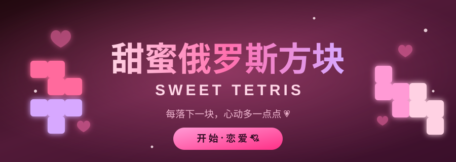

<div align="center">
  
</div>

<div align="center">

# 甜蜜俄罗斯方块 💕 Sweet Tetris

> **一边消方块，一边谈恋爱。** 每落下一块，心动就多一点点 💗


**🎮 在线试玩** · **✨ 特色玩法** · **⌨️ 操作说明** · **🏆 计分规则**

</div>

---

## 💗 这是什么？

一个会「心跳」的俄罗斯方块。

它不是冷冰冰的方块机器，而是一场小小的恋爱：你每放下一个方块，屏幕上的**甜蜜值**就会上升；消行、连击会让她迅速脸红；当甜蜜值攒满 100%，整个世界会为你下起一场**爱心暴雨** 💞

纯前端单文件实现，**无需安装、无需联网、打开浏览器就能玩**。

---

## 🎮 在线试玩

> 开启 GitHub Pages 后，点开链接即可畅玩（手机 / 电脑都行）：
>
> ### 👉 <https://daishuhe.github.io/VSCODE/tetris-sweet.html>

**或者本地游玩（零配置）：**

```bash
git clone https://github.com/daishuhe/VSCODE.git
cd VSCODE
# 直接双击打开 tetris-sweet.html 即可开始 💘
```

---

## ✨ 特色玩法

### 💞 甜蜜值系统 —— 恋爱需要经营

每放下一个方块 **+1.6**，每消一行 **+14**（连击还有额外加成）。
但注意：甜蜜值会随时间**缓慢回落**，就像感情需要持续用心 💗

| 甜蜜值 | 阶段 | 心情 |
|:---:|:---|:---|
| 0% | 恋人未满 | 💔 还没开始呢 |
| 1–19% | 悄悄喜欢 | 🩷 偷偷心动 |
| 20–39% | 怦然心动 | 💖 心跳漏一拍 |
| 40–59% | 暧昧升温 | 💕 有点意思了 |
| 60–79% | 热恋中 | 💗 黏在一起 |
| 80–99% | 心动不已 | 💓 快要溢出来 |
| **100%** | **恋爱满值** | 💞 **甜蜜爆裂！** |

### 💥 甜蜜爆裂 —— 满值就开大

甜蜜值攒满 **100%** 的瞬间：

- 🌧️ 全屏落下 **140 颗爱心雨**
- ⚡ 消除得分 **×2**，持续 **9 秒**
- 🎁 立即获得 **500 × 当前等级** 的奖励分
- 💥 屏幕闪光 + 震动 + 合成音效齐发

这是翻盘时刻，也是秀操作的高光时刻。

### 🔥 连击系统

连续消行会累积 **连击倍数**，连击越高分越多，还会弹出「甜蜜暴击 ×N 💞」的飘字。手速快的人，真的很迷人。

### 🌸 甜蜜粉色系方块

七种方块全部重新调色：樱花粉、淡粉、香芋紫、玫瑰粉、蜜桃粉、深玫红、珊瑚粉。视觉上就是一杯草莓奶昔 🍓

### ✨ 手感与氛围拉满

- 落块、旋转、消行、暂存……每一次操作都有**爱心 / 星星 / 花瓣粒子**迸发
- 消行时**屏幕闪光 + 抖动**，4 行直接喊出 **TETRIS!**
- 背景有缓缓上浮的爱心与光斑，全屏 Canvas 实时渲染
- 随机弹出甜甜的提示语：「好甜呀 🍬」「我们好配 💞」「你接住我了 💗」

### 🎵 温柔合成音效

所有音效由 **Web Audio API** 实时合成（无任何音频文件），移动、旋转、消行、升级、爆裂各有旋律，柔和不刺耳。右下角一键静音 🔇

### 📱 手机也能玩

底部自带 **触摸按钮**（左右移动 / 旋转 / 加速 / 直落 / 暂存 / 暂停），手机浏览器打开即玩。

---

## ⌨️ 操作说明

| 按键 | 功能 |
|:---:|:---|
| `←` `→` | 左右移动 |
| `↑` | 旋转方块 |
| `↓` | 加速下落 |
| `空格` | 直接落底（硬降） |
| `C` | 暂存 / 取出方块 |
| `P` | 暂停游戏 |
| `回车` | 开始 / 再来一局 |

> 游戏内还会显示**下一个**方块队列（预览 6 个）和**暂存区**，方便你提前布局。

---

## 🏆 计分规则

| 消除行数 | 基础分 | 名称 |
|:---:|:---:|:---|
| 1 行 | 100 × 等级 | 单消 |
| 2 行 | 300 × 等级 | 双消 |
| 3 行 | 500 × 等级 | 三消 |
| 4 行 | 800 × 等级 | 💥 **TETRIS!** |

- 连击加成：`+(连击数 − 1) × 50 × 等级`
- 软降：每格 **+1** 分　｜　硬降：每格 **+2** 分
- 甜蜜爆裂期间：**全部得分 ×2**
- 每消 **10 行**升 1 级，方块下落速度随之加快（最快 80ms / 格）
- 最高分保存在浏览器本地，随时回来挑战自己 🥇

---

## 🛠️ 技术栈

| | |
|:---|:---|
| 渲染 | 原生 Canvas 2D（背景氛围层 + 前景特效层）+ DOM 网格 |
| 音效 | Web Audio API 实时合成 |
| 特效 | 自研粒子系统（爱心 / 星星 / emoji / 飘字 / 抖动 / 闪光） |
| 存储 | `localStorage` 保存最高分 |
| 依赖 | **无** —— 单个 `.html` 文件，零构建、零依赖 |

---

## 📁 文件结构

```
VSCODE/
├── tetris-sweet.html          # 💕 甜蜜俄罗斯方块（本作，主角！）
├── tetris.html                # 🎮 经典俄罗斯方块
├── pet.html                   # 🐾 养宠物小游戏
├── sweet-tetris-banner.svg    # 🎨 README 横幅
└── README.md
```

---

## 🤝 欢迎一起来玩

- ⭐ 觉得甜的话，点个 **Star** 支持一下～
- 🐛 发现 Bug 或有新点子（比如「异地恋模式」「情话连击」），欢迎提 **Issue**
- 🔧 喜欢就 **Fork** 一份，改成属于你的版本（换成你喜欢的配色 / 名字 / 音乐）

---

## 📜 License

MIT License · 自由使用、修改、分享。

<div align="center">

**祝你每一局，都甜到心里 💗**

`🍬 甜蜜暴击 · 恋爱加速中`

</div>
